# RL-based SFC prototype

## Requirements

1. Ubuntu 20.04
2. Python 3.8 or higher
3. Network traffic data

## Installation

1. Clone the repository:

```bash
git clone https://github.com/mizolotu/izi
```

2. Create data directory:

```bash
cd izi
mkdir data
mkdir data/raw
```

3. Download network traffic PCAP data, e.g. from https://www.unb.ca/cic/datasets/ids-2018.html or any other source into ```data/raw``` directory, file path should look as follows:

```bash
data
  └── raw
       └── subdir
             └── PCAP file
```

4. Install (makes sense to use sudo user for pip): 
  - libpcap-dev (apt), pcappy (pip), kaitaistruct (pip), tcpreplay (apt), wireshark (apt)
  - numpy (pip), pandas (pip), sklearn (pip), scipy (pip)
  - tensorflow 2 (pip), tflite-runtime (pip)
  - libvirt (apt), vagrant (apt), python-vagrant (pip), paramiko (pip)
  - plotly (pip), orca (manual)
  - flask (pip), requests (pip)
  - vagrant-libvirt (vagrant)
  - cloudpickle (pip), opencv-python (pip), lxml (pip), dicttoxml (pip)

This list is most likely not full, just follow the instructions, if some package is missing, install it using apt or pip depending on the package.  

## Prepare ML classifiers

1. Split the PCAP data unto chunks: 

```bash
python3 split_data.py 
```

2. Create datasets:

```bash
python3 create_datasets.py
```

This may take some time, depending on the amount of the data and your computational power.

3. Train classifiers:

```bash
python3 train_classifiers.py -a <attack label> -s <sampling interval>
```

For correct attack labels, check parameter ```labels``` in file ```data/features/metainfo.json```. You should train at least one classifier for each attack label. Sampling interval is one of the following values: 1, 2, 4, 8 or 16. You can also change type of the model, its number of layers and number of neurons in each layer. You can implement more model types, e.g. anomaly detection models, models with attention and recurrent layers, etc.

4. You can plot results with

```bash
python3 plot_roc.py

```
ROC curves will be saved in ```figures/roc``` directory.

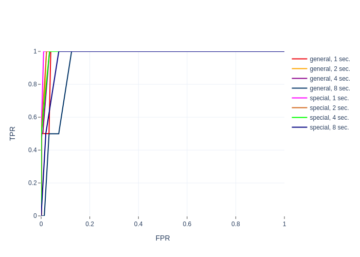 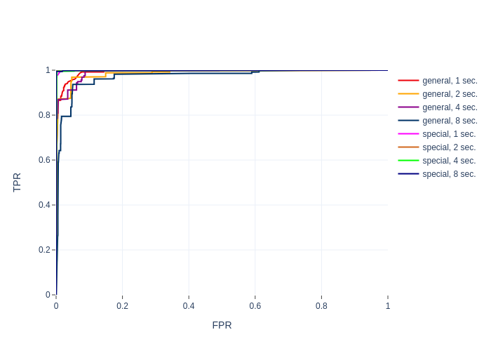 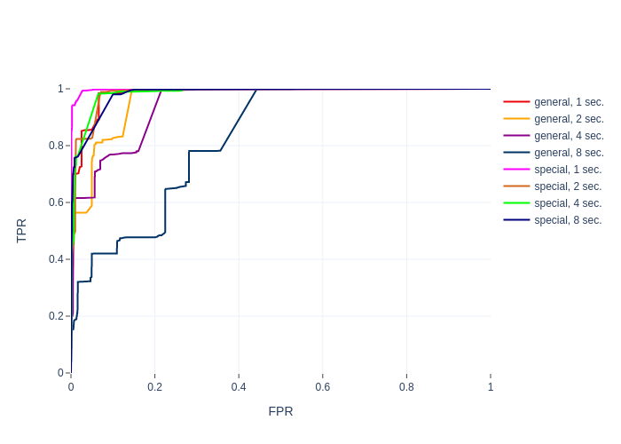
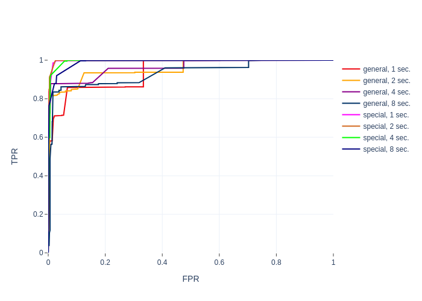 

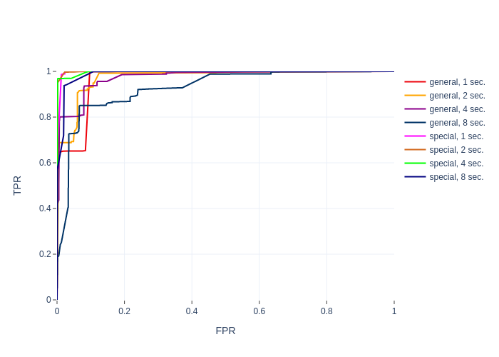 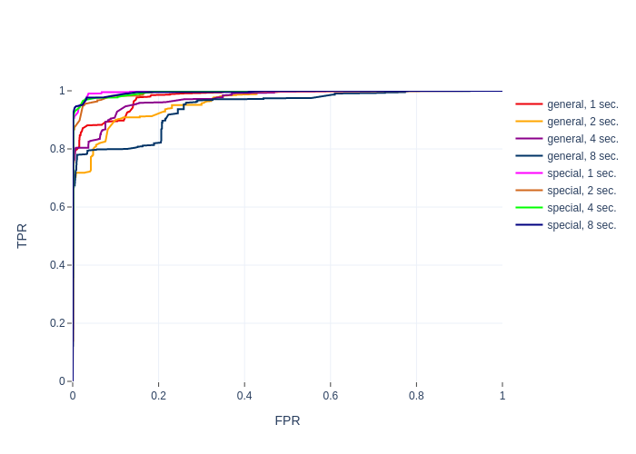 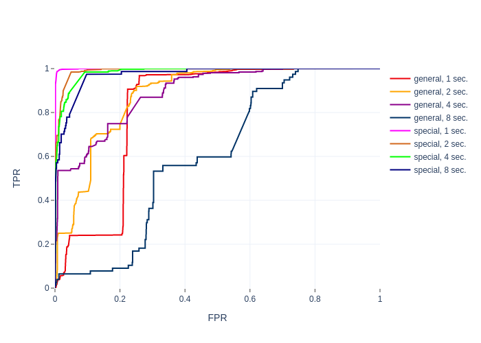 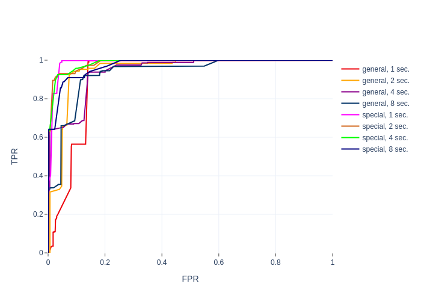


## Create environment

1. Download SDN controller and convert tensorflow models into tflite format:

```bash
python3 prepare_sources.py
```

2. Create VMs (this will not generate any output, so if there is an error, you will never know): 

```bash
sudo python3 create_vms.py
```
Instead, you can create VMs one-by-one using vagrant command line tool, e.g. 

```bash
sudo vagrant up <vm name>
```
This will provide more debug information. VM names can be found in ```Vagrantfile```: odl, ovs_0, etc. Once all VMs are created, you still have to run:

```bash
sudo python3 create_vms.py
```

to collect necessary information about VM ips, keys, etc. VM provision will be omitted. 

3. Connect VMs with VXLAN tunnels: 

```bash
sudo python3 connect_switches.py
```

4. Calculate probabilities for sampling certain traffic files depending on the attack scenario:

```bash
python3 calculate_probabilities.py
```

## Train and evaluate RL-agent

1. Start training an RL agent:

```bash
sudo python3 train_agent.py
```

2. Continue training the agent:

```bash
sudo python3 train_agent.py -c <path_to_checkpoint_file>
```

3. Plot the results:

```bash
python3 plot_progress.py
```

Progress figures will be saved in ```figures/progress``` directory.

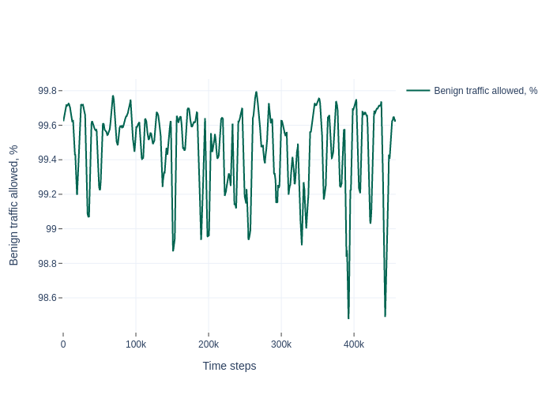 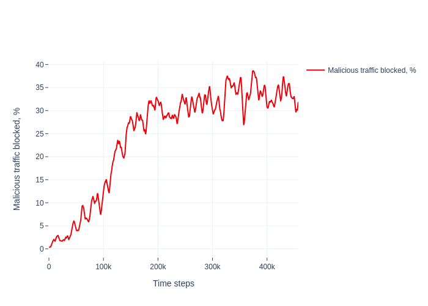 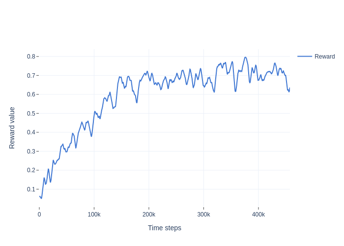
