# RL-based SFC prototype

## Requirements

1. Ubuntu 20.04
2. Python 3.8 or higher
3. Network traffic data

## Installation

1. Clone the repository:

```bash
git clone https://github.com/mizolotu/izi
```

2. Create data directory:

```bash
cd izi
mkdir data
```

3. Install necessary apt packages: 
```bash
sudo apt install libpcap-dev qemu-kvm libvirt-daemon-system libvirt-clients bridge-utils virtinst virt-manager vagrant python3-dev python3-pip
```

4. Install python packages with sudo user:  

```bash
pip3 install pypcap pandas sklearn tensorflow==2.5.2 python-vagrant paramiko cloudpickle opencv-python lxml dicttoxml scapy 
```

## Prepare data

1. Create directory "raw" in "data":

```bash
mkdir data/raw
```

2. Download network traffic PCAP data, e.g. from https://www.unb.ca/cic/datasets/ids-2018.html or any other source into ```data/raw``` directory, file path should look as follows:

```bash
data
  └── raw
       └── subdir
             └── PCAP file
```

3. Split the PCAP data unto chunks: 

```bash
python3 split_data.py 
```

## Train ML classifiers (optional)


1. Create datasets:

```bash
python3 extract_features.py
```

This may take some time, depending on the amount of the data and your computational power.

2. Train classifiers:

```bash
python3 train_ids_models.py -m <model_type> -t <train_labels> -v <validation_labels> -i <inference_labels>
```

For example, to train a convolutional classifier to detect all the attacks in the default dataset, execute:

```bash
python3 train_ids_models.py -m cnn -t 0,1,2,3 -v 0,1,2,3 -i 0,1,2,3
```

To train an anomaly detection model using self-organizing map algorithm, execute:

```bash
python3 train_ids_models.py -m som -t 0 -v 0,1,2,3 -i 0,1,2,3
```
3. You can plot results with

```bash
python3 plot_roc.py

```
ROC curves will be saved in ```figures/roc``` directory.

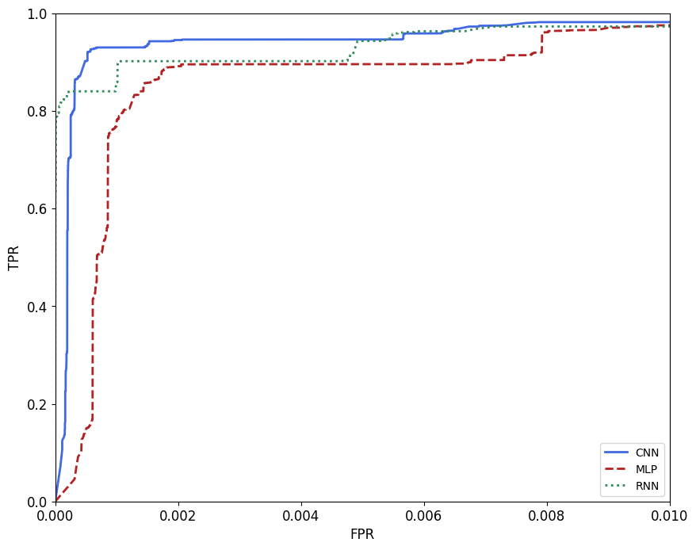 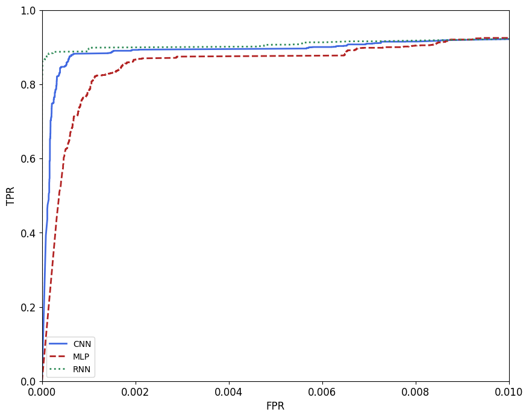 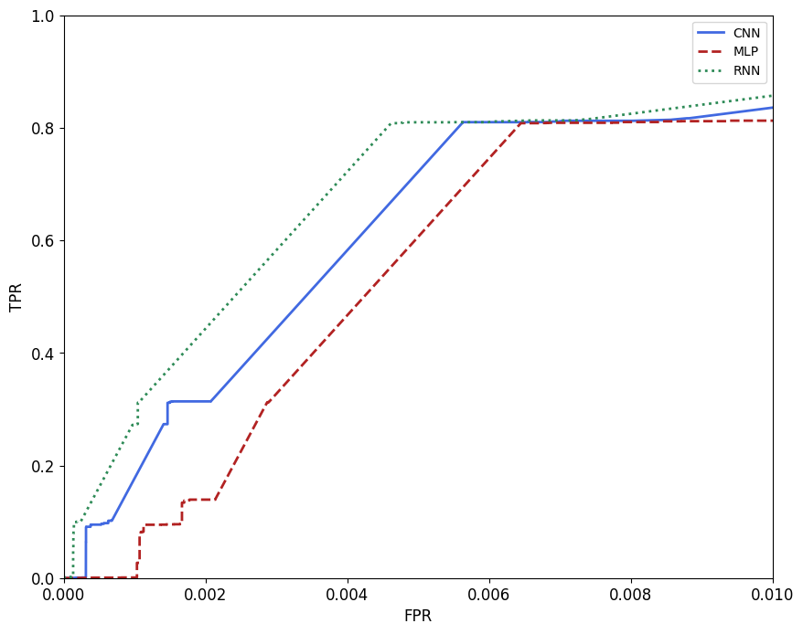

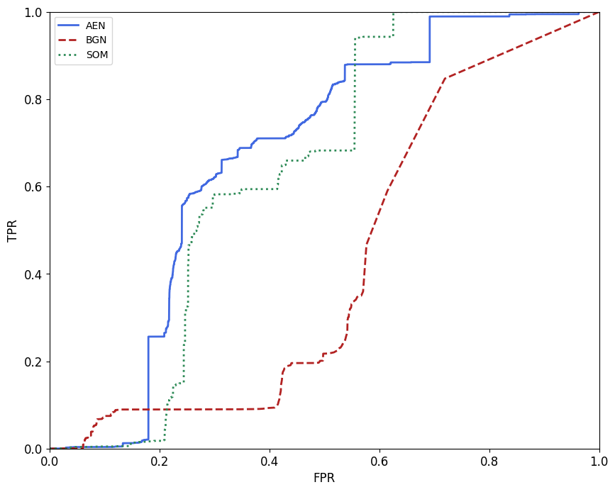 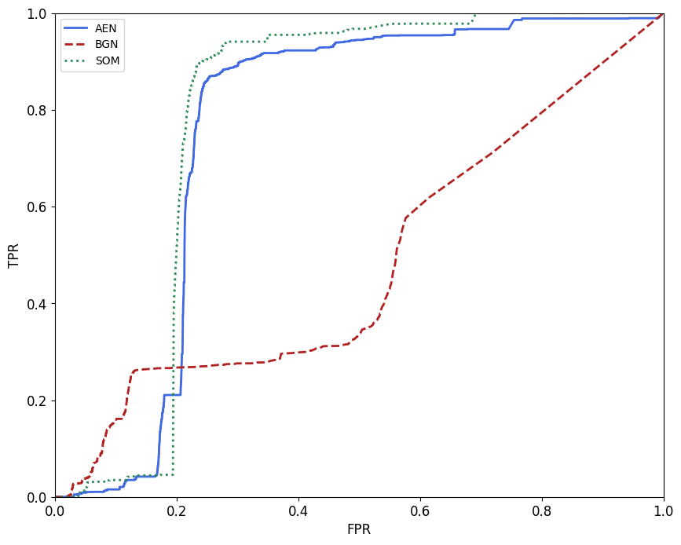 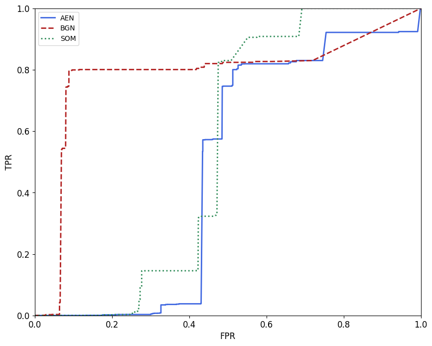

## Create environment

1. If needed, modify values ```nenvs``` (number of environments) and ```env_vms['ids']['n']``` (number of security middle boxes in an environment) in file ```config.py```. Minimum values are correspondingly 1 and 1, maximum depend on the amount of computational and memory resources you have. 

2. Prepare all resources needed for the environment:

```bash
python3 prepare_sources.py
```

3. Create VMs one-by-one using vagrant command line tool, e.g. 

```bash
vagrant up <vm name>
```
VM names can be found in ```Vagrantfile```, e.g. odl_0_0, ovs_0_0, ids_0_0, etc. Once all VMs are created, run:

```bash
python3 create_vms.py
```

to collect necessary information about VM ips, keys, etc.

Instead of using vagrant command tool, you can also try to create VMs using this script with additional argument (this however will not generate any output, so if there is an error, you will never know): 

```bash
python3 create_vms.py -p True
```

4. Connect VMs:

```bash
python3 connect_vms.py
```

5. Restart services:

```bash
python3 reload_sources.py
```

## Train and evaluate RL-agent

1. Start training an RL agent:

```bash
python3 train_agent.py
```

or continue training the agent for a saved checkpoint:

```bash
python3 train_agent.py -c <path_to_checkpoint_file>
```

2. Evaluate the policy trained with RL:

```bash
python3 test_agent.py -c <path_to_checkpoint_file>
```

or some manually defined policy:

```bash
python3 test_agent.py -p <manual_policy>
```

An example of such manual policy in the environment with only one IDS is to mirror all the traffic to the IDS and block all traffic sources that generate alerts: 0,1,2,3,4,5,6,7,8,9,10,11,54;24,25,26,27,28,29,30,31,32,33,34,35.

3. Plot the results:

```bash
python3 plot_progress.py
```

Progress figures will be saved in ```figures/progress``` directory.

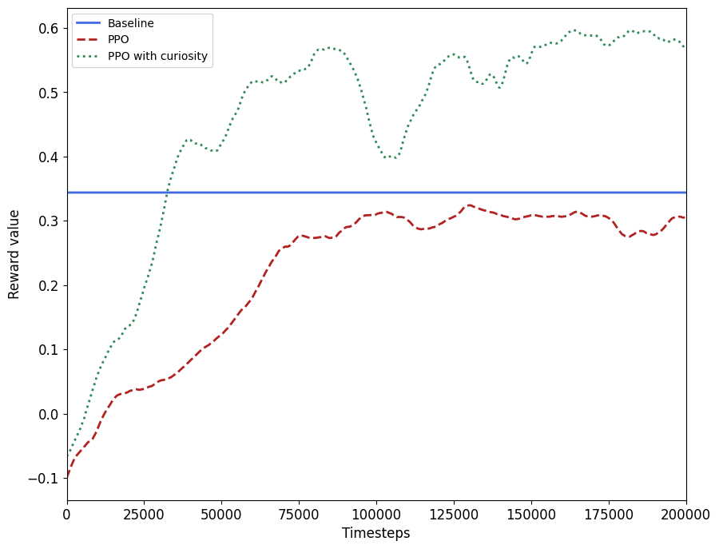 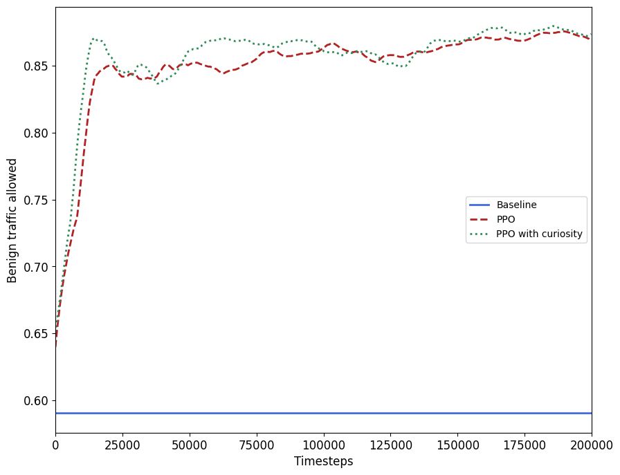 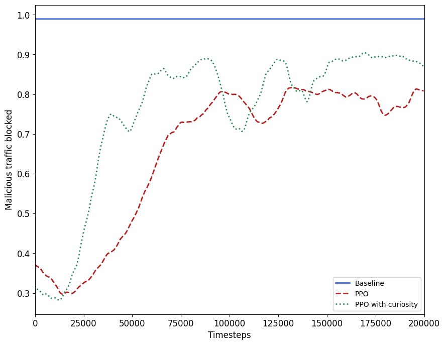 

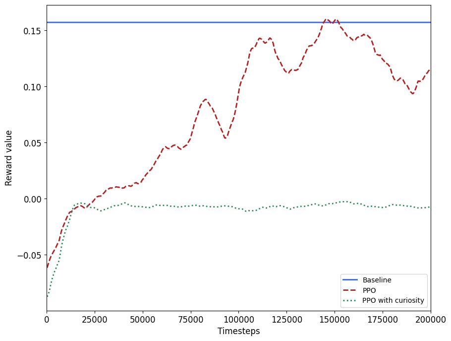 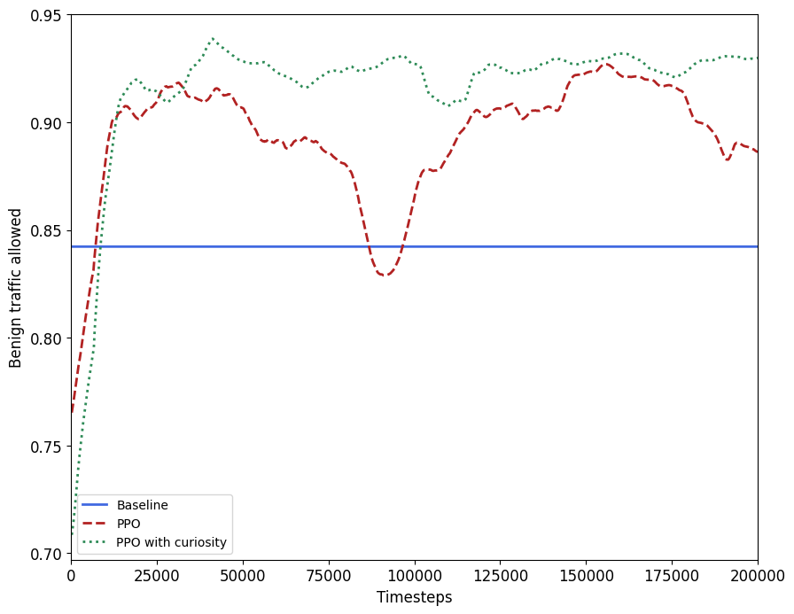 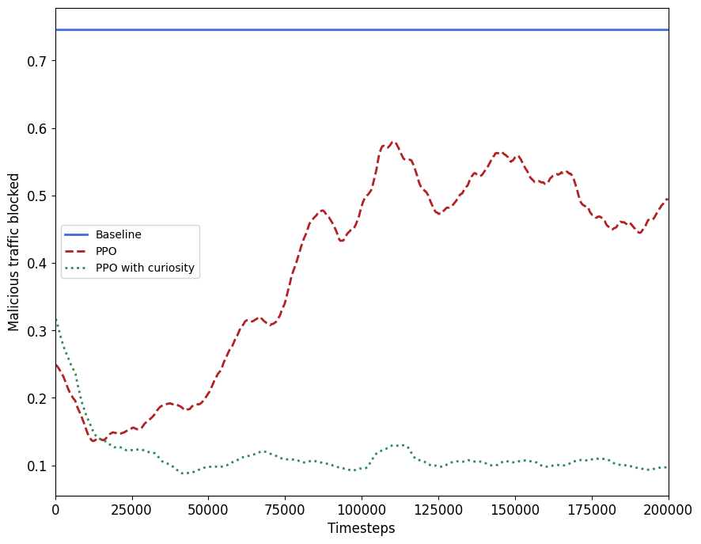 

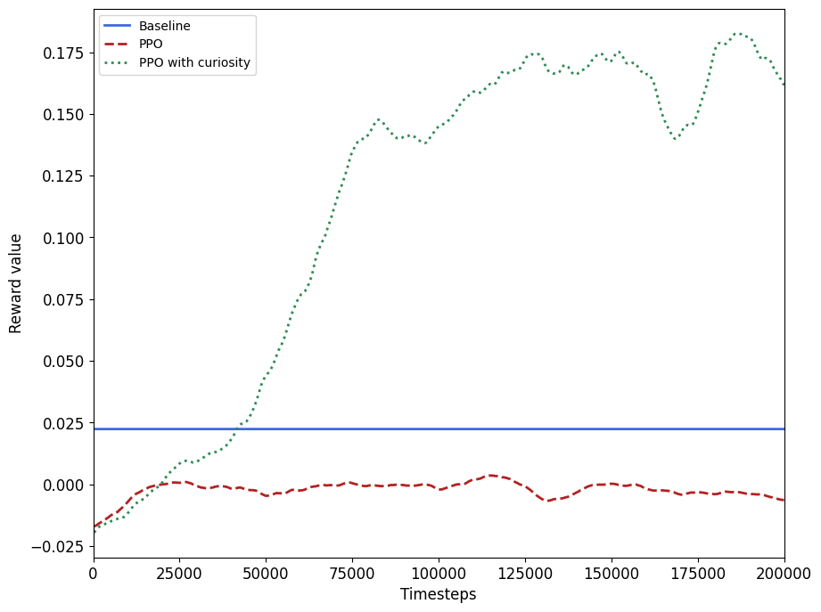 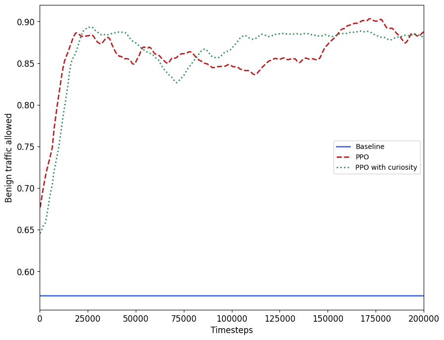 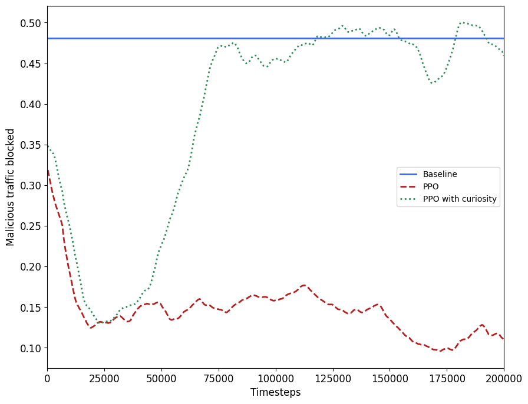 
