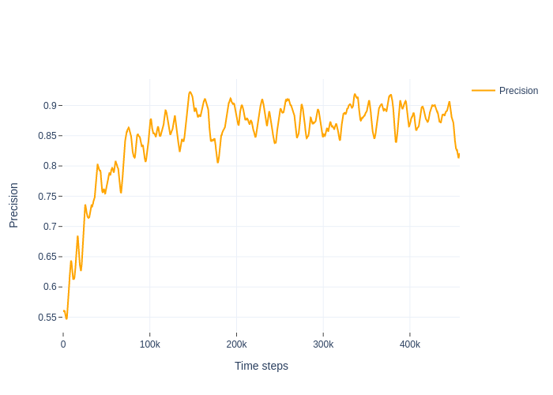

# RL-based SFC prototype

## Requirements

1. Ubuntu 20.04
2. Python 3.8 or higher
3. Network traffic data

## Installation

1. Clone the repository:

```bash
git clone https://github.com/mizolotu/izi
```

2. Create data directory:

```bash
cd izi
mkdir data
mkdir data/raw
```

3. Download network traffic PCAP data, e.g. from https://www.unb.ca/cic/datasets/ids-2018.html or any other source into ```data/raw``` directory, file path should look as follows:

```bash
data
  └── raw
       └── subdir
             └── PCAP file
```

4. Install necessary apt packages: 
```bash
sudo apt install libpcap-dev qemu-kvm libvirt-daemon-system libvirt-clients bridge-utils virtinst virt-manager vagrant python3-dev
```

5. Install python packages with sudo user:  

```bash
sudo pip3 install pypcap pandas sklearn tensorflow==2.5.0 python-vagrant paramiko cloudpickle opencv-python lxml dicttoxml
```
6. Install tflite runtime:

```bash
sudo pip3 install --extra-index-url https://google-coral.github.io/py-repo/ tflite_runtime
```

7. Download orca binaries from https://github.com/plotly/orca/releases, make it executable and copy somewhere on your PATH, e.g.:

```bash
chmod +x orca-X.Y.Z-x86_64.AppImage
sudo cp /path/to/orca-X.Y.Z-x86_64.AppImage /usr/bin/orca
```

## Prepare ML classifiers

1. Split the PCAP data unto chunks: 

```bash
python3 split_data.py 
```

2. Create datasets using different sampling interval, e.g. 0.5, 1, 2, etc:

```bash
python3 extract_features.py -s <sampling interval>
```

This may take some time, depending on the amount of the data and your computational power.

3. Train classifiers:

```bash
python3 train_classifiers.py -a <attack label> -s <sampling interval>
```

For correct attack labels, check parameter ```labels``` in file ```data/features/metainfo.json```. You should train at least one classifier for each attack label. Sampling interval is one of the values you used for dataset generation. You can also change type of the model, its number of layers and number of neurons in each layer. You can implement more model types, e.g. anomaly detection models, models with attention and recurrent layers, etc.

4. You can plot results with

```bash
python3 plot_roc.py

```
ROC curves will be saved in ```figures/roc``` directory.

  
 

   


## Create environment

1. Calculate probabilities for sampling certain traffic files depending on the attack scenario:

```bash
python3 calculate_frequencies.py
```

2. If needed, modify values ```nenvs``` (number of environments) and ```env_vms['ids']['n']``` (number of security middle boxes in an environment) in file ```config.py```. Minimum values are correspondingly 1 and 1, maximum depend on the amount of computational and memory resources you have. 

3. Prepare all resources needed for the environment:

```bash
sudo python3 prepare_sources.py
```

4. Create VMs one-by-one using vagrant command line tool, e.g. 

```bash
sudo vagrant up <vm name>
```
VM names can be found in ```Vagrantfile```, e.g. odl_0_0, ovs_0_0, ids_0_0, etc. Once all VMs are created, run:

```bash
sudo python3 create_vms.py
```

to collect necessary information about VM ips, keys, etc.

Instead of using vagrant command tool, you can also try to create VMs using this script with additional argument (this however will not generate any output, so if there is an error, you will never know): 

```bash
sudo python3 create_vms.py -p True
```

5. Connect VMs:

```bash
sudo python3 connect_vms.py
```

## Train and evaluate RL-agent

1. Start training an RL agent:

```bash
sudo python3 train_agent.py
```

or continue training the agent for a saved checkpoint:

```bash
sudo python3 train_agent.py -c <path_to_checkpoint_file>
```

2. Evaluate the policy trained with RL:

```bash
sudo python3 test_agent.py -c <path_to_checkpoint_file>
```

or some manually defined policy:

```bash
sudo python3 test_agent.py -p <manual_policy>
```

An example of such manual policy in the environment with only one IDS is to mirror all the traffic to the IDS and block all traffic sources that generate alerts: 0,1,2,3,4,5,6,7,8,9,10,11,54;24,25,26,27,28,29,30,31,32,33,34,35.

3. Plot the results:

```bash
python3 plot_progress.py
```

Progress figures will be saved in ```figures/progress``` directory.

  

 
